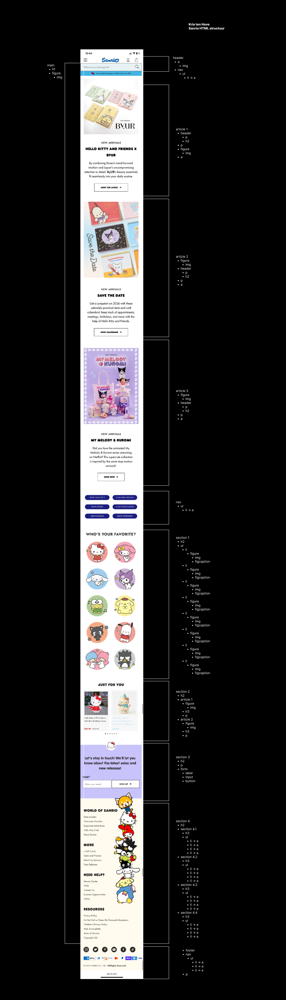
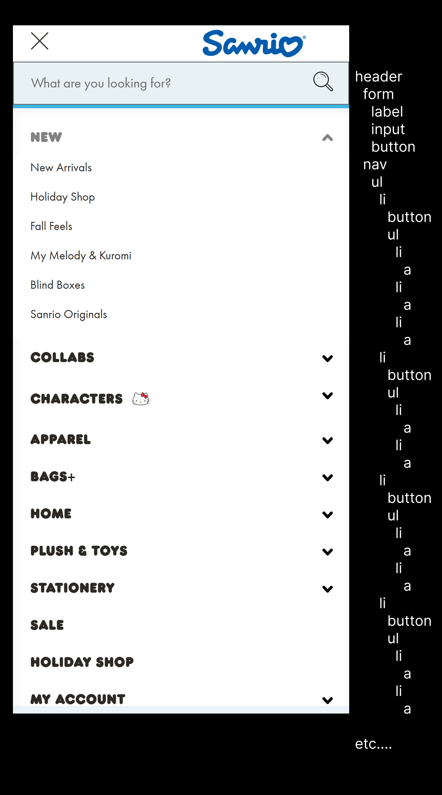

# Procesverslag
Markdown is een simpele manier om HTML te schrijven.  
Markdown cheat cheet: [Hulp bij het schrijven van Markdown](https://github.com/adam-p/markdown-here/wiki/Markdown-Cheatsheet).

Nb. De standaardstructuur en de spartaanse opmaak van de README.md zijn helemaal prima. Het gaat om de inhoud van je procesverslag. Besteedt de tijd voor pracht en praal aan je website.

Nb. Door *open* toe te voegen aan een *details* element kun je deze standaard open zetten. Fijn om dat steeds voor de relevante stuk(ken) te doen.

## Jij

  
uitwerken voor kick-off werkgroep

  ### Auteur:
  Kris ten Hove

  #### Je startniveau:
  blauw (nog startend)

  #### Je focus:
  responsive
 

## Je website

  
uitwerken voor kick-off werkgroep

  ### Je opdracht:
https://www.sanrio.com/

  #### Screenshot(s) van de eerste pagina (small screen): 
  https://www.sanrio.com/  
  

  #### Screenshot(s) van de tweede pagina (small screen):
 https://www.sanrio.com/collections/kuromi/products/kuromi-lovestruck-plush-mascot-keychain-my-melody-kuromi-netflix-series
  
 

## Toegankelijkheidstest 1/2 (week 1)

  
uitwerken na test in 2e werkgroep

  ### Bevindingen
  Lijst met je bevindingen die in de test naar voren kwamen:
- missende h1 waardoor hele structuur niet klopt
- te veel headings waardoor het niet toegankelijk is voor screenreaders
- soms onduidelijke beschrijvingen bij fotos
- ongedefinieerde containers of onlogische elementen
- te kleine klik-ruimte

## Breakdownschets (week 1)

  
uitwerken na afloop 3e werkgroep

  ### de hele pagina: 
  

  ### dynamisch deel (bijv menu): 
  

## Voortgang 1 (week 2)

  
uitwerken voor 1e voortgang

  ### Stand van zaken
In dit eerste deel van het proces ben ik vooral bezig geweest met het structureren van de pagina: de header, main en footer overzichtelijk indelen en bepalen waar kopjes, sublinks en de zoekbalk komen. Ik heb ook opgezocht of je meerdere navs mag gebruiken, wat kan voor bijvoorbeeld een hoofdmenu en een footer. Daarnaast heb ik gekeken naar sections in sections, wat semantisch correct is zolang elke section een eigen thema of subcategorie heeft. Alle informatie heb ik gehaald uit de presentaties tijdens de lessen en de MDN-website.

VOORBEELD:   <section>
            <h2>WORLD OF SANRIO</h2>
            <section>
                <h3>SITE GUIDE</h3>
                <ul>
                    <li><a href="#">Shop All</a></li>
                    <li><a href="#">New Arrivals</a></li>
                    <li><a href="#">Characters</a></li>
                    <li><a href="#">About Sanrio</a></li>
                </ul>
            </section>
            <section>
                <h3>CHARACTERS</h3>
                <ul>
                    <li><a href="#">Hello Kitty</a></li>
                    <li><a href="#">My Melody</a></li>
                    <li><a href="#">Kuromi</a></li>
                    <li><a href="#">Cinnamoroll</a></li>
                </ul>
            </section>
            <section>
                <h3>NEED HELP?</h3>
                <ul>
                    <li><a href="#">Contact Us</a></li>
                    <li><a href="#">FAQ</a></li>
                    <li><a href="#">Shipping Info</a></li>
                    <li><a href="#">Returns</a></li>
                </ul>
            </section>
            <section>
                <h3>RESOURCES</h3>
                <ul>
                    <li><a href="#">Accessibility</a></li>
                    <li><a href="#">Terms & Conditions</a></li>
                    <li><a href="#">Privacy Policy</a></li>
                    <li><a href="#">Store Locator</a></li>
                </ul>
            </section>
        </section>

  ### Agenda voor meeting
  samen met je groepje opstellen

  | student 1    Yuzhong | student 2      Anastasia    | student 3   Eme  | student 4   Kris     |
  | ---                  | ---                         | ---              | ---                  |
  | dit bespreken        | en dit                      | en ik dit        | verloopt goed        |
  | en dat ook nog       | dit als er tijd is          | nog een punt     | alleen vraag over    |
  | ...                  | ...                         | ...              | zoekbalk             |

  ### Verslag van meeting
  hier na afloop snel de uitkomsten van de meeting vastleggen

  - punt 1
  - punt 2
  - nog een punt
  - ...

## Voortgang 2 (week 3)

  
uitwerken voor 2e voortgang

  ### Stand van zaken
  hier dit ging goed & dit was lastig (neem ook screenshots op van delen van je website en code)

  ### Agenda voor meeting
  samen met je groepje opstellen

  | student 1      | student 2          | student 3    | student 4        |
  | ---            | ---                | ---          | ---              |
  | dit bespreken  | en dit             | en ik dit    | en dan ik dat    |
  | en dat ook nog | dit als er tijd is | nog een punt | dit wil ik zeker |
  | ...            | ...                | ...          | ...              |

  ### Verslag van meeting
  hier na afloop snel de uitkomsten van de meeting vastleggen

  - punt 1
  - punt 2
  - nog een punt
- ...

## Toegankelijkheidstest 2/2 (week 4)

  
uitwerken na test in 9e werkgroep

  ### Bevindingen
  Lijst met je bevindingen die in de test naar voren kwamen (geef ook aan wat er verbeterd is):

## Voortgang 3 (week 4)

  
uitwerken voor 3e voortgang

  ### Stand van zaken
  hier dit ging goed & dit was lastig (neem ook screenshots op van delen van je website en code)

  ### Agenda voor meeting
  samen met je groepje opstellen

  | student 1      | student 2          | student 3    | student 4        |
  | ---            | ---                | ---          | ---              |
  | dit bespreken  | en dit             | en ik dit    | en dan ik dat    |
  | en dat ook nog | dit als er tijd is | nog een punt | dit wil ik zeker |
  | ...            | ...                | ...          | ...              |

  ### Verslag van meeting
  hier na afloop snel de uitkomsten van de meeting vastleggen

  - punt 1
  - punt 2
  - nog een punt
  - ...

## Eindgesprek (week 5)

  
uitwerken voor eindgesprek

  ### Je uitkomst - karakteristiek screenshots:
  

  ### Dit ging goed/Heb ik geleerd: 
  Korte omschrijving met plaatjes

  

  ### Dit was lastig/Is niet gelukt:
  Korte omschrijving met plaatjes

  

## Bronnenlijst

  
continu bijhouden terwijl je werkt

  Nb. Wees specifiek ('css-tricks' als bron is bijv. niet specifiek genoeg). 
  Nb. ChatGpT en andere AI horen er ook bij.
  Nb. Vermeld de bronnen ook in je code.

  1. bron 1
  2. bron 2
  3. ...

